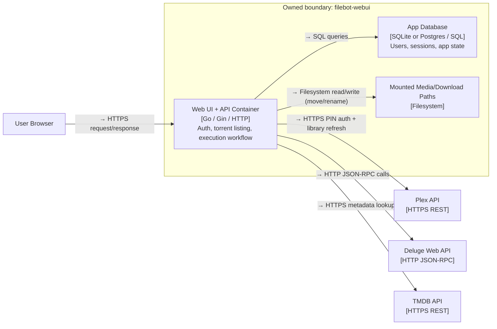
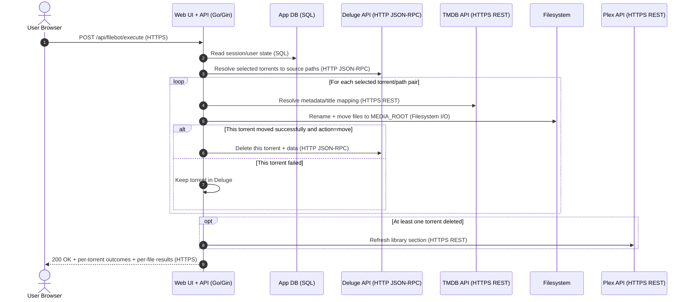

# Architecture Diagrams

## C4 — Level 2: filebot-webui Containers
Scope: deployable containers and external integrations for runtime architecture.

**Decisions recorded here:**
- Backend remains one Go container so handler/service/repository layering stays strict without distributed complexity.
- Storage is modeled as a separate container concern to keep SQLite/Postgres swappable by configuration.
- External calls stay synchronous in execution flow so cleanup can run per-torrent immediately after each successful move.

## Sequence Diagram — Rename/Move Execution Flow
Scope: end-to-end request path from user action to cleanup and library refresh.

**Decisions recorded here:**
- Deluge cleanup is conditional per torrent, so successful moves are cleaned even when another selected torrent fails.
- Result payload includes per-torrent moved/deleted/failed status plus per-file outcomes so partial failures are visible.
