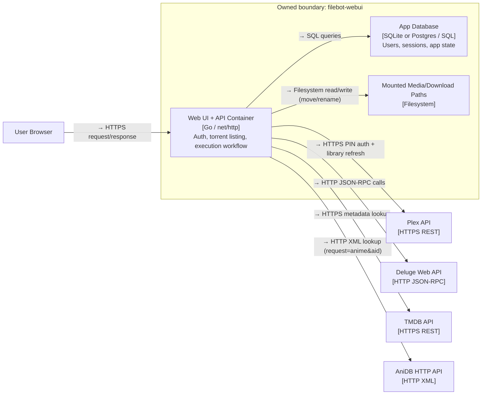
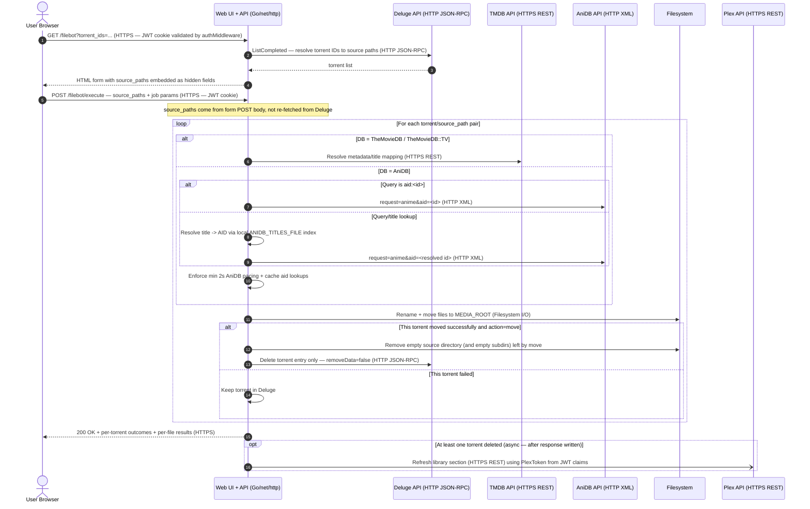
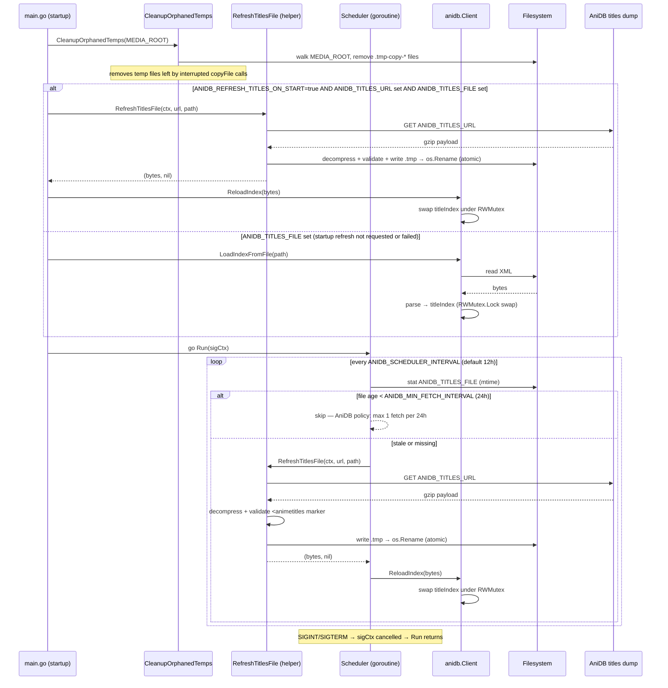

# Architecture Diagrams

## C4 — Level 2: filebot-webui Containers
Scope: deployable containers and external integrations for runtime architecture.

**Decisions recorded here:**
- Backend remains one Go container so handler/service/repository layering stays strict without distributed complexity.
- Storage is modeled as a separate container concern to keep SQLite/Postgres swappable by configuration.
- External calls stay synchronous in execution flow so cleanup can run per-torrent immediately after each successful move.
- AniDB integration uses contract-safe requests (`client/clientver/protover/request`) with local AID cache and 2s pacing guard to reduce flood risk.

## Sequence Diagram — Rename/Move Execution Flow
Scope: end-to-end request path from user action to cleanup and library refresh.

Two HTTP round-trips: GET /filebot (form) resolves torrents from Deluge and embeds source_paths into the HTML form; POST /filebot/execute receives those paths directly — no second Deluge call for path resolution.

**Decisions recorded here:**
- Deluge cleanup is conditional per torrent, so successful moves are cleaned even when another selected torrent fails. After a successful move the handler removes the (now-empty) source directory tree itself, then calls `core.remove_torrent` with `removeData=false` — removing only the torrent entry. Passing `true` caused Deluge to stat/delete already-moved files, surfacing a Python stat error in the JSON-RPC response.
- Plex library refresh fires in a background goroutine using `context.WithoutCancel` **after** the HTTP response is written. A slow Plex API (~2s) was causing browser i/o timeouts which triggered duplicate form POSTs; the duplicate hit the already-moved source path and produced a misleading stat error. Firing async eliminates the timeout window. The response always reports `plexRefreshed=true` when a refresh is scheduled (not confirmed), which is sufficient for the UI toast.
- `WriteTimeout` is set to **20 minutes** (vs the Go default of 0 / the prior value of 30s). Large season packs (e.g. a full season of 10 × 1080p episodes) can take well over 30s to move across filesystems. The 30s limit caused the TCP socket to die mid-job; when Go tried to write the response the write failed with `i/o timeout`, the browser retried the POST, and the duplicate request stat'd the already-moved source directory and failed. Single-user personal app — no DoS surface to protect.
- Result payload includes per-torrent moved/deleted/failed status plus per-file outcomes so partial failures are visible.
- AniDB flow prefers direct `aid:<id>` from `--q`; title-based lookup (via local index) strips episode markers before searching so bare `E01`, `- 01`, `#01`, `OVA N`, `Part N` in filenames do not corrupt the query.
- Episode detection for TV accepts `SxxEyy`, `S01.E01`, `S01 E01`, and `NxYY`; for anime it additionally handles bare-dash, hash, OVA/SP, and Part (arabic + roman) markers.
- `SearchTV` sends `first_air_date_year` (show premiere year) not season year. Filenames like `Rick and Morty - Stagione 09 (2026)` yield year=2026 which returns zero results. Client retries without year filter on empty response — the year-filter retry is transparent to callers.
- `normalizeQuery` truncates at the first `SxxExx` code for TV filenames so episode titles (e.g. "Catfish Hunter" in `Futurama.S14E02.Catfish.Hunter.…`) never reach the search query. Release group suffix (`-TheBlackKing`, `-YIFY`) is stripped before sep normalization while the hyphen is intact. Streaming source codes (`DSNP`, `AMZN`, `NFLX`, `DDP5`, etc.) are in the noise allowlist.
- Cross-device moves fall back to copy+delete; `copyFile` writes to a `.tmp-copy-*` temp in the target dir then renames atomically — startup cleanup removes any orphans left by a crash. After rename, `copyFile` calls `os.Chmod` to restore the source file's permission bits (default `os.CreateTemp` mask is `0600`, which blocks Plex from reading the file) and `os.Lchown` to preserve uid/gid when the process has `CAP_CHOWN`.
- Season-folder torrents (e.g. `Rick and Morty - Stagione 09 (2026)/`) are common: the torrent root is a directory containing per-episode `.mkv` files. `collectVideoFiles` walks the directory normally for both `move` and `test` actions when the path exists on disk. Virtual paths (dev-mode, no disk) fall back to appending `.mkv` to the name.
- Torrents with nested season subfolders (`S1/`, `S2/`) auto-trigger recursive walk without requiring the user to tick the recursive checkbox. `hasVideoSubdirs` detects the pattern (direct child dirs containing video files) and retries with `recursive=true` when more files are found.
- Query derivation cascades: torrent root folder name → immediate parent of first episode file → episode filename itself. First candidate that normalizes to a non-empty string wins. This handles group-tagged episode filenames like `[AnimeGroup] - 01 [1080p].mkv` that strip to empty, using the informative torrent root (e.g. `Lo stregone Orphen (1998-2000)`) instead.
- `--log`, `--format`, `TheTVDB`, `AcoustID`, and `OMDb` removed from the native engine allowlist and form — unsupported databases are rejected at validation, not silently ignored.

## Sequence Diagram — AniDB Titles Scheduler
Scope: background goroutine lifecycle — startup index load, periodic freshness check, atomic disk write, live in-memory reload.

**Decisions recorded here:**
- Startup temp cleanup runs before any other init so orphaned `.tmp-copy-*` files from crashed copy operations are removed before new moves start — prevents stale files accumulating in `MEDIA_ROOT`.
- File mtime is the freshness signal — no separate state file needed; atomic rename keeps mtime accurate.
- `ReloadIndex` swaps the in-memory index under `RWMutex` so concurrent `SearchAnime` calls are never blocked longer than a pointer swap.
- `TryLock` on the scheduler mutex prevents overlapping downloads when a tick fires while a previous slow download is still in progress.
- `short` and `kana` title types are excluded from the index to prevent abbreviations (`CotS`, `SnM`) causing spurious ambiguity hits.
