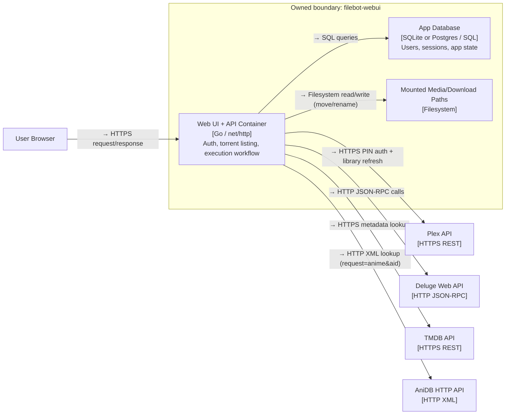
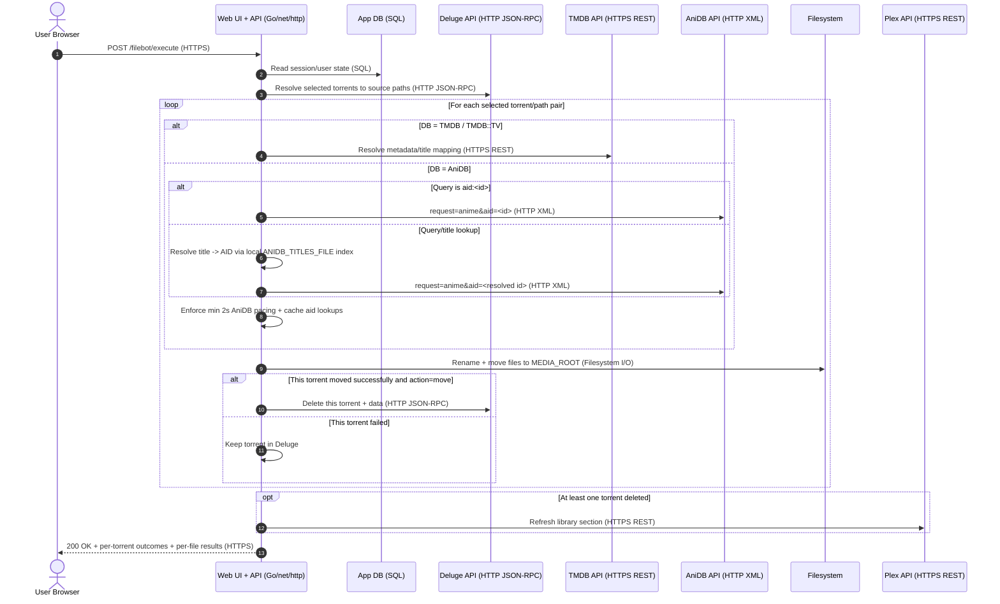
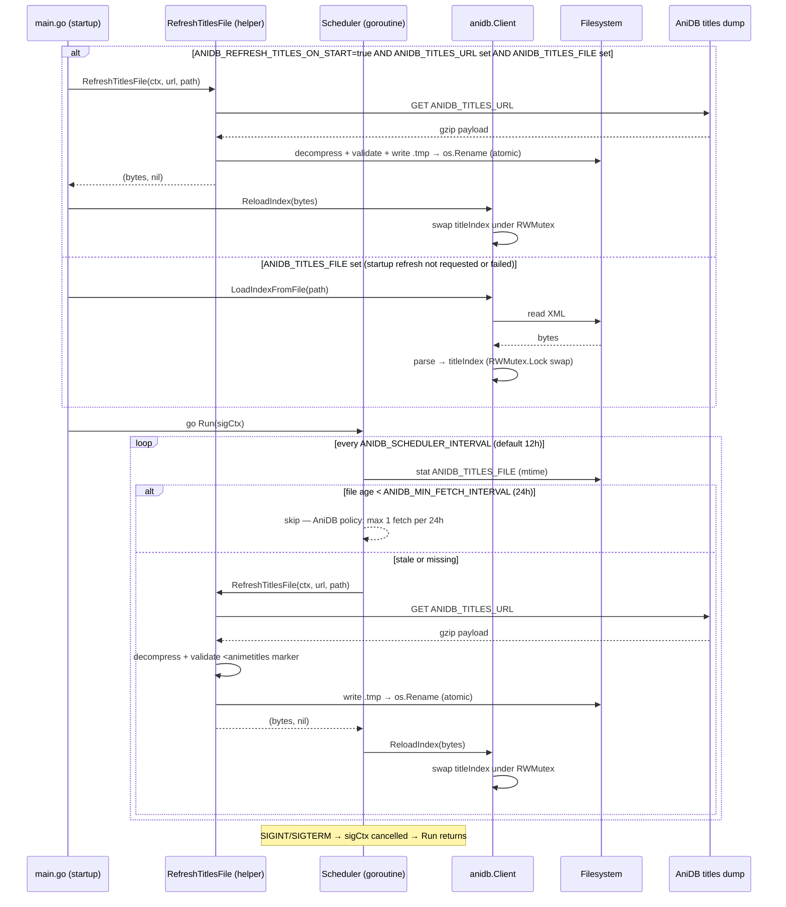

# Architecture Diagrams

## C4 — Level 2: filebot-webui Containers
Scope: deployable containers and external integrations for runtime architecture.

**Decisions recorded here:**
- Backend remains one Go container so handler/service/repository layering stays strict without distributed complexity.
- Storage is modeled as a separate container concern to keep SQLite/Postgres swappable by configuration.
- External calls stay synchronous in execution flow so cleanup can run per-torrent immediately after each successful move.
- AniDB integration uses contract-safe requests (`client/clientver/protover/request`) with local AID cache and 2s pacing guard to reduce flood risk.

## Sequence Diagram — Rename/Move Execution Flow
Scope: end-to-end request path from user action to cleanup and library refresh.

**Decisions recorded here:**
- Deluge cleanup is conditional per torrent, so successful moves are cleaned even when another selected torrent fails.
- Result payload includes per-torrent moved/deleted/failed status plus per-file outcomes so partial failures are visible.
- AniDB flow prefers direct `aid:<id>` from `--q`; title-based lookup (via local index) strips episode markers before searching so bare `E01`, `- 01`, `#01`, `OVA N`, `Part N` in filenames do not corrupt the query.
- Episode detection for TV accepts `SxxEyy`, `S01.E01`, `S01 E01`, and `NxYY`; for anime it additionally handles bare-dash, hash, OVA/SP, and Part (arabic + roman) markers.

## Sequence Diagram — AniDB Titles Scheduler
Scope: background goroutine lifecycle — startup index load, periodic freshness check, atomic disk write, live in-memory reload.

**Decisions recorded here:**
- File mtime is the freshness signal — no separate state file needed; atomic rename keeps mtime accurate.
- `ReloadIndex` swaps the in-memory index under `RWMutex` so concurrent `SearchAnime` calls are never blocked longer than a pointer swap.
- `TryLock` on the scheduler mutex prevents overlapping downloads when a tick fires while a previous slow download is still in progress.
- `short` and `kana` title types are excluded from the index to prevent abbreviations (`CotS`, `SnM`) causing spurious ambiguity hits.
